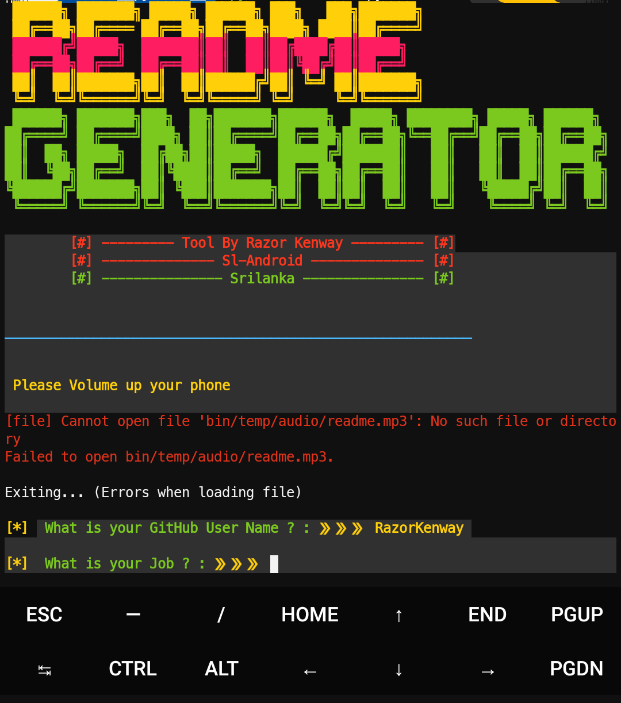

# README-Generator
This is a Simple tool for github users.you can create professional README.md file for your repository..

## Command list👇👇

> pkg update && pkg upgrade

> pkg install git

> pkg install figlet

> pkg install lolcat

> git clone https://github.com/RazorKenway/README-Generator.git

> cd README-Generator

> python requirements.py

> python readmeGEN.py

### Razor Kenway

### video Lesson here : https://youtu.be/ZOJl_OCh8zA

 

## Join with us 😎

<a href="https://www.facebook.com/groups/277920623081269/?ref=share">Facebook Group </a>

<a href="https://www.facebook.com/SLAndroidD/">Facebook page </a>

<a href="https://www.youtube.com/c/SLAndroid"> SL Android On Youtube  </a>

<a href="https://t.me/joinchat/MaJux1c8gdMW2GSqCpEBxQ"> Telegram Group </a>

